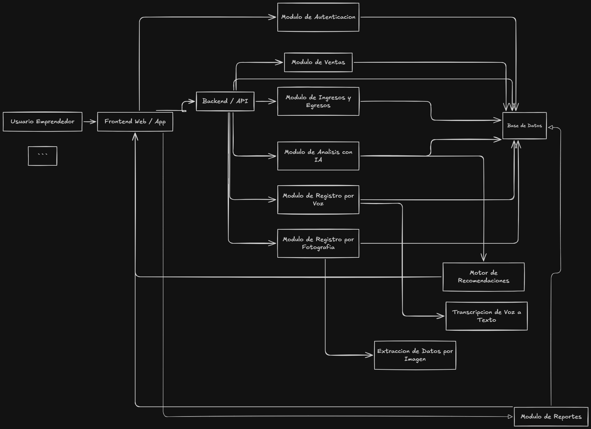

# Arquitectura del Sistema

# Arquitectura del Sistema

## Estructura de Carpetas

```
├─ backend/
│  ├─ package.json
│  ├─ prisma/
│  │  ├─ schema.prisma
│  │  ├─ seed.js
│  │  ├─ migrations/
│  │  └─ seeds/
│  └─ src/
│     ├─ app.js
│     ├─ server.js
│     ├─ config/
│     │  ├─ constants.js
│     │  ├─ crawler.js
│     │  ├─ env.js
│     │  └─ prisma.js
│     ├─ controllers/
│     │  ├─ auth.controller.js
│     ├─ services/
│     │  ├─ auth.service.js
│     │  └─ users.service.js
│     ├─ repositories/
│     │  ├─ auth.repository.js
│     │  └─ users.repository.js
│     ├─ routes/
│     │  ├─ auth.routes.js
│     │  ├─ users.routes.js
│     │  └─ index.js
│     ├─ middlewares/
│     ├─ errors/
│     │  ├─ appError.js
│     └─ helpers/
│
├─ frontend/
│  ├─ package.json
│  ├─ tsconfig.json
│  ├─ .env.example
│  └─ src/
│     ├─ main.tsx
│     ├─ App.tsx
│     ├─ app/
│     │  ├─ router.tsx
│     │  ├─ providers.tsx
│     │  └─ store.ts
│     ├─ shared/
│     │  ├─ api/
│     │  │  └─ httpClient.ts
│     │  ├─ components/
│     │  ├─ hooks/
│     │  ├─ types/
│     │  ├─ css/
│     │  └─ utils/
│     ├─ features/
│     │  ├─ auth/
│     │  │  ├─ api/
│     │  │  ├─ components/
│     │  │  ├─ hooks/
│     │  │  ├─ pages/
│     │  │  ├─ types/
|     │     ├─ css/
│     │  │  └─ index.ts
│
```

## Tecnologías

- **Frontend**: React + TypeScript + CSS
- **Backend**: Express + TypeScript + Prisma


## Diagrama de componentes

Este diagrama muestra la estructura general del sistema propuesto, incluyendo frontend, backend, base de datos, modulos funcionales y componentes de apoyo para IA, voz, imagen y reportes.



## Componentes principales

- `Frontend Web / App`
- `Modulo de Autenticacion`
- `Backend / API`
- `Modulo de Ventas`
- `Modulo de Ingresos y Egresos`
- `Modulo de Analisis con IA`
- `Modulo de Registro por Voz`
- `Modulo de Registro por Fotografia`
- `Motor de Recomendaciones`
- `Transcripcion de Voz a Texto`
- `Extraccion de Datos por Imagen`
- `Base de Datos`
- `Modulo de Reportes`
